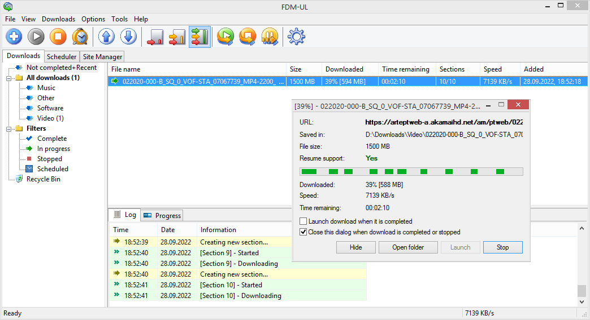

# Free Download Manager Ultra-Light (FDM-UL)

A stripped-down, portable (not using the Windows Registry at all) version of [Free Download Manager](https://www.freedownloadmanager.org/) Classic for Windows with various outdated and irrelevant features removed, and therefor with small memory footprint (particularly if compared with current FDM versions based on Qt).

FDM-UL is based on the source code of [FDM 3.9.7](https://sourceforge.net/p/freedownload/code/HEAD/tree/), with about 50% of the original code removed.

**New Features**

* SOCKS5 proxy support
* Integrated minimal web interface  
  If activated, it only provides the single HTTP endpoint "/adddownload.req?URL=[url]". Useful for adding download jobs to FDM-UL from a browser via [boomarklet](https://en.wikipedia.org/wiki/Bookmarklet) or [contextlet](https://github.com/davidmhammond/contextlets).

**Removed Features**

* Bittorrent support
* Browser integration based on outdated plugin interfaces (COM, NSAPI)
* Streaming protocols (Flash Video Streams/RTMP, RTSP, MMS)
* Dial-up connections/RAS
* Integration of Anti-Virus software
* "Mirrors" (looking up files at file-hosting services which were common back then)
* Site Explorer
* HTML Spider
* Floating extra windows
* Skins
* Language localisation (english only UI)
* Download history
* Registry access

**Usage**

FDM-UL.exe is a single file app that must be run from a folder with write access. Application settings are saved in an INI file in the same folder, and additional state infos in (at most) 3 binary *.sav files.

**Screenshot**

