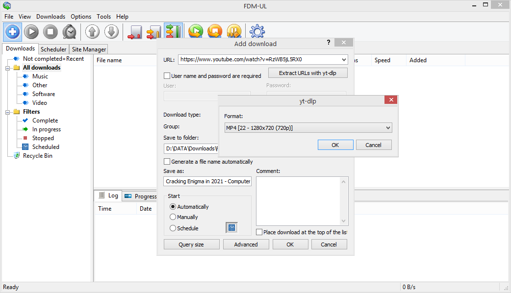

# Free Download Manager Ultra-Light (FDM-UL)

A stripped-down, portable (not using the Windows Registry at all) version of [Free Download Manager](https://www.freedownloadmanager.org/) Classic for Windows with various outdated and irrelevant features removed, and therefor with small memory footprint (particularly if compared with current FDM versions based on Qt).

FDM-UL is based on the source code of [FDM 3.9.7](https://sourceforge.net/p/freedownload/code/HEAD/tree/), with about 50% of the original code removed.

**New Features**

* SOCKS5 proxy support
* Integrated minimal HTTP interface  
  If activated, it only provides the single HTTP endpoint "/adddownload.req?URL=[url]". Useful for adding download jobs to FDM-UL from a browser via [boomarklet](https://en.wikipedia.org/wiki/Bookmarklet) or [contextlet](https://github.com/davidmhammond/contextlets) using fetch.
* URL extraction based on yt-dlp  
  FDM-UL checks on startup if yt-dlp.exe is found in the exe's folder or somewhere in the system path (alternatively the path to yt-dlp.exe can also be specified in the settings dialog). If yt-dlp.exe is available, a button "Extract URLs with yt-dlp" is displayed in the "Add download" dialog that allows to extract actual media URLs from e.g. YouTube or Vimeo page URLs. Note that yt-dlp.exe is only used for URL extraction, not for download, and therefor neither HLS nor DASH streams are shown and supported, but only standard HTTP(S) download URLs.  
* "WM_COPYDATA API"  
  Download jobs can be added to FDM-UI by sending WM_COPYDATA messages to its main window, e.g. from a another C/C++, Java, Python or Node.js application. In the sent COPYDATASTRUCT, 'lpData' contains the download URL and 'dwData' specifies if the download is added silently (0) or shows the standard "Add download" dialog (1).

**Removed Features**

* Bittorrent support
* Browser integration based on outdated plugin interfaces (COM, NSAPI)
* Streaming protocols (Flash Video Streams/RTMP, RTSP, MMS)
* Dial-up connections/RAS
* Integration of Anti-Virus software
* "Mirrors" (looking up files at file-hosting services which were common back then)
* Site Explorer
* HTML Spider
* Community/Opinions
* Floating extra windows
* Plugin API
* Skins
* Language localisation (english only UI)
* Download history
* Registry access
* ...

**Usage**

FDM-UL.exe is a single file app that must be run from a folder with write access. Application settings are saved in an INI file in the same folder, and additional state infos in (at most) 4 binary *.sav files.

**Screenshots**

*Main window*  

*Basic yt-dlp integration*  

